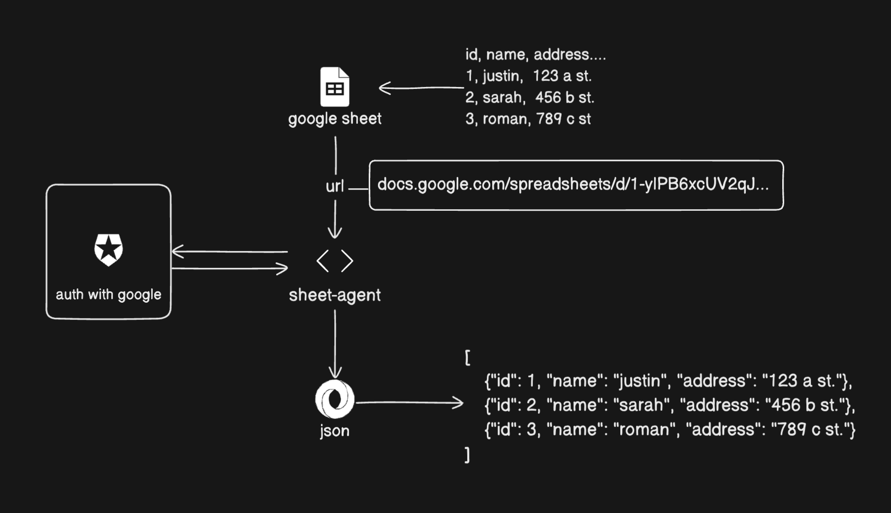

    

# Sheets Agent

## Overview

Sheets Agent is a Go-based application designed to interact with Google Sheets and produce json from that speadsheet.

## Features

- Read data from Google Sheets

## Design



## Installation

To install Sheets Agent, clone the repository and build the application:

1. Create an OAuth 2.0 credentials file: follow these steps [Google OAuth 2.0 Instructions](https://developers.google.com/identity/protocols/oauth2)
2. Run following commands

```sh
git clone https://github.com/jtefteller/sheets-agent.git
cd sheets-agent
make install # follow instructions
```

## Usage

To use Sheets Agent, run the executable with the necessary flags and arguments:

```sh
go run main.go -u <SHEETS_URL> -r <SHEET_RANGE> -p <SHEET_PAGE>
```

## Contributing

Contributions are welcome! Please fork the repository and submit a pull request.
